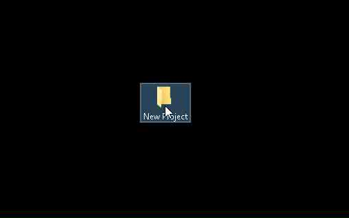
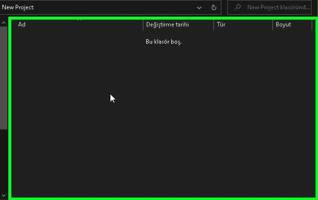
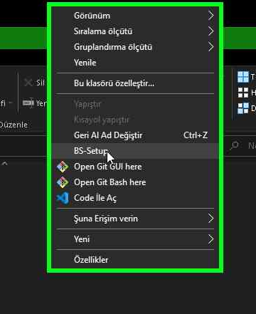
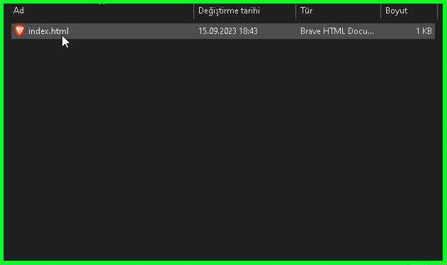

# Boostrap-Setup
A simple bs-setup index html creator program for Windows.

## Install:
1) Download the latest release from [here](https://github.com/sanalzio/Boostrap-Setup/releases).

2) Extract files.

3) Run Install.bat

## Usage
**1. Create new project folder.**

**2. Right click to folder content.**

**3. Click to `BS-Setup`**

**4. And use Boostrap.**

